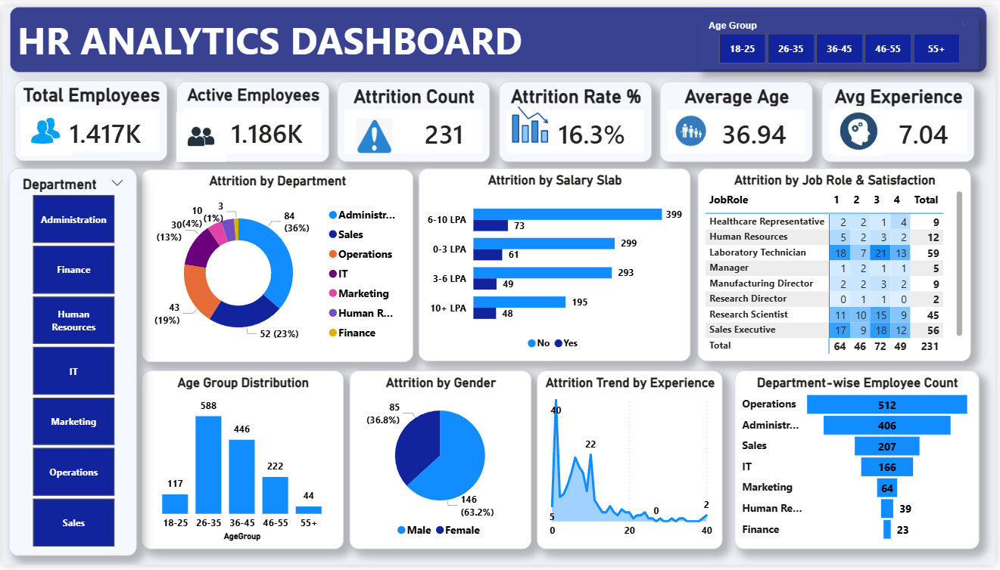

# 🧠 HR Analytics Dashboard | Power BI

> Transforming raw HR data using Power Query into actionable insights to understand employee attrition and workforce trends.

---

## 🚀 Project Overview
This project presents an interactive HR Analytics Dashboard built using Power BI to analyze employee data across key dimensions such as attrition, demographics, salary, and department distribution.

The dashboard enables quick identification of workforce patterns and helps in making data-driven HR decisions.

---

## 🎯 Business Objective
To analyze employee data and identify key factors driving attrition, helping organizations improve retention strategies and workforce planning.

---

## 🧹 Data Preparation (Power Query)
The dataset was directly loaded into Power BI and transformed using Power Query.

Key steps performed:
- Removed null values and duplicate records  
- Standardized categorical fields (Department, Gender, etc.)  
- Converted columns to appropriate data types   
- Cleaned inconsistencies to ensure accurate analysis  

---

## 📊 Data Modeling & DAX
- Built data model within Power BI  
- Created DAX measures for:
  - Total Employees  
  - Attrition Count  
  - Attrition Rate (%)  
- Used calculated columns for segmentation and grouping  

---

## 📊 Key Metrics Snapshot
- 👥 Total Employees: **1,417**
- ✅ Active Employees: **1,186**
- ❗ Attrition Count: **231**
- 📉 Attrition Rate: **16.3%**
- 🎂 Average Age: **36.94**
- 💼 Average Experience: **7.04 years**

---

## 📈 Key Insights
- 🏢 Highest attrition observed in **Administration (36%)**, followed by Sales and Operations  
- 💰 Employees in **lower salary slabs (0–3 LPA & 3–6 LPA)** show higher attrition  
- 👨‍💼 Male employees (~63%) have higher attrition compared to female employees  
- 📊 Majority workforce lies in the **26–35 age group**, showing notable attrition  
- ⏳ Employees with lower experience levels are more likely to leave  
- 📍 Operations department has the highest employee count  

---

## 📸 Dashboard Preview

---

## 🎥 Dashboard Demo
[▶️ Watch Demo Video](hr_dashboard_demo.mp4)

---

## 📁 Project Files
- 📊 [Download Dashboard (.pbix)](HR_Analytics_Dashboard.pbix)  
- 📂 [Download Dataset](HR_Analytics_Data.xlsx)  
- 🖼️ [View Dashboard Image](hr_dashboard_overview.png)  
- 🎥 [Watch Demo Video](hr_dashboard_demo.mp4)  

---

## 🧩 Dashboard Features
- KPI cards for quick insights  
- Attrition analysis by department, salary, and demographics  
- Age group and gender distribution  
- Interactive filters and slicers  
- Experience-based trend analysis  

---

## 🛠 Tech Stack
- Power BI (Power Query, DAX, Data Visualization)  
- Excel (Raw Data Source)  

---

## 🖥️ How to Use
1. Download the `.pbix` file  
2. Open it in Power BI Desktop  
3. Use slicers and filters to explore insights  

---

## 📈 Business Impact
This dashboard helps:
- Identify high-risk attrition segments  
- Support data-driven HR decisions  
- Improve employee retention strategies  

---

## 🔮 Future Enhancements
- Predictive attrition analysis using Machine Learning  
- Real-time HR data integration  
- Advanced employee segmentation  

---

## 👤 Author
**Saniya Siddiquie**  
Data Analyst | Power BI | Excel | SQL  

🔗 GitHub: https://github.com/saniyasiddiqui7  
🔗 LinkedIn: https://www.linkedin.com/in/saniya-siddique

---

⭐ If you found this project useful, consider giving it a star!
